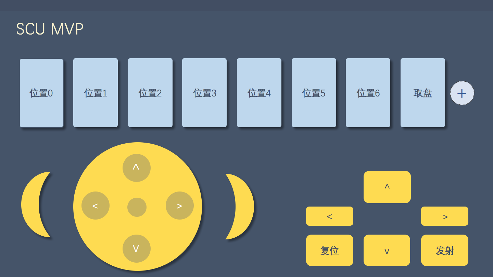
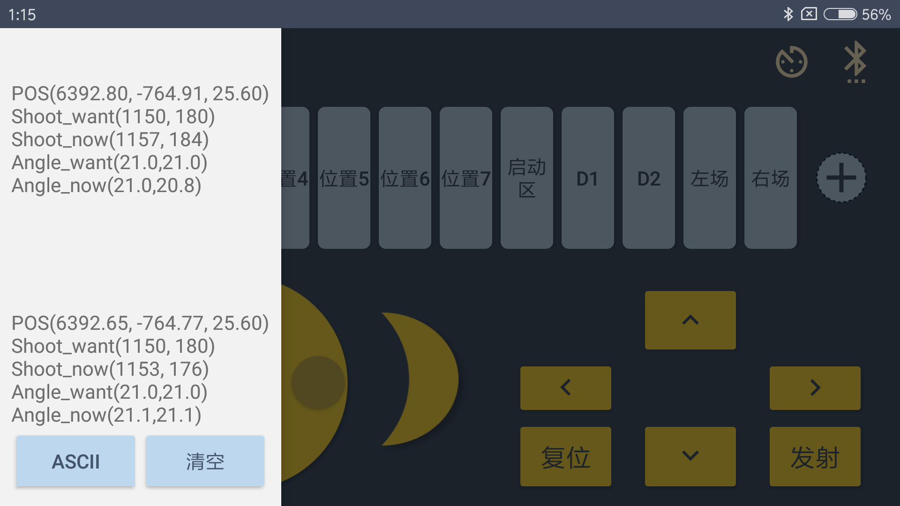

# Robocon2017BTControl
为robocon2017,  四川大学代表队 SCU_MVP 打造的控制app

* 蓝牙通讯app（classical Bluetooth RFCOMM），兼容HC-05/HC-06， 不支持BLE(low energy）蓝牙设备
* 支持自定义添加控制按钮，自定义按钮发送信息
* 支持虚拟摇杆
* 支持串口数据回显
* app中集成蓝牙连接接口
* 方便二次开发

## 截图展示

